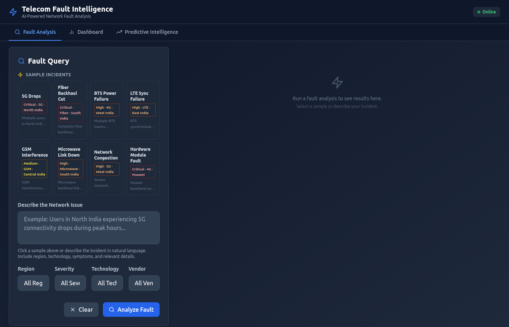
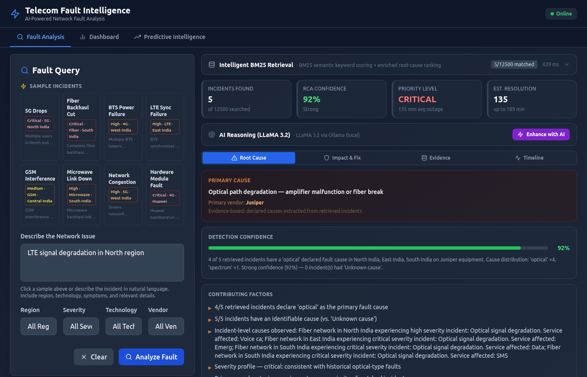
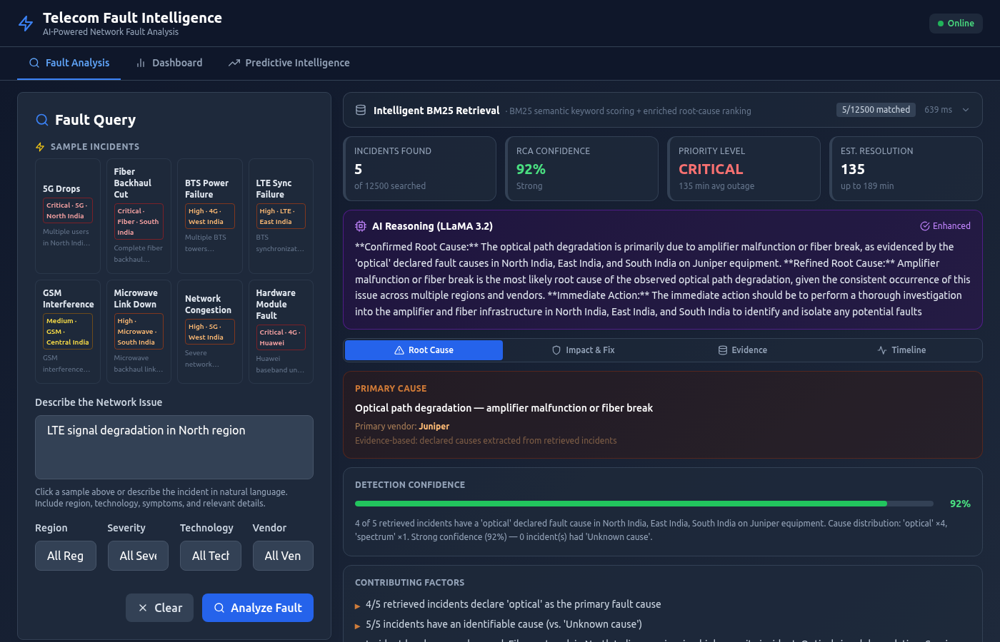
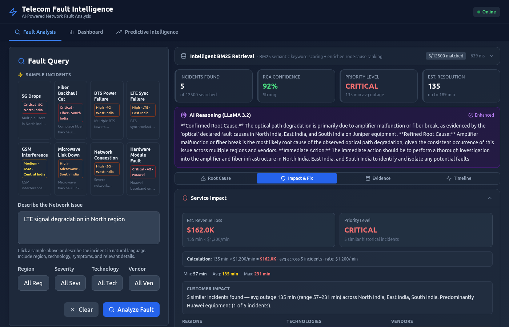
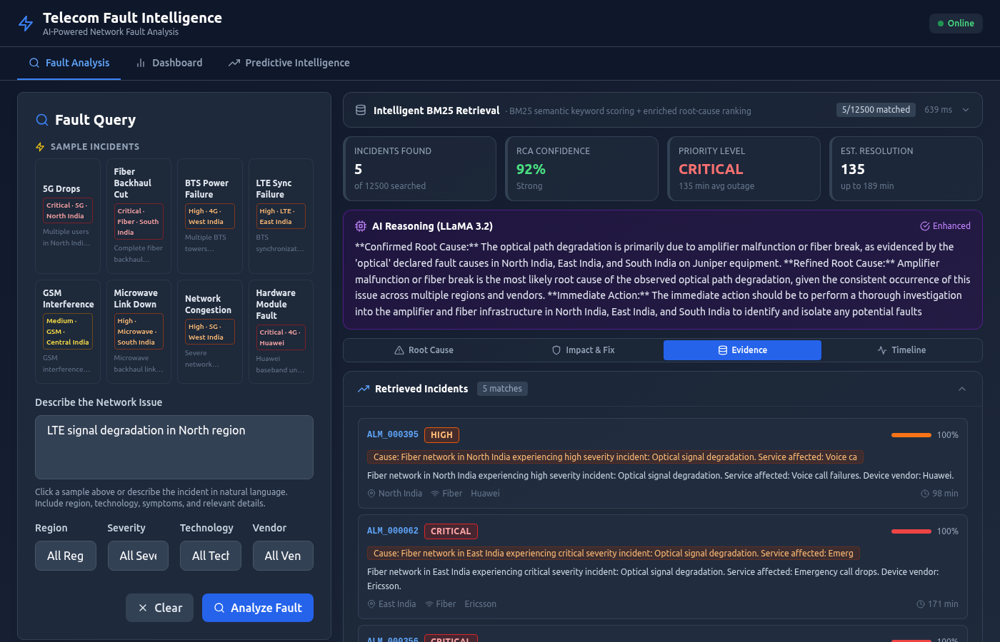
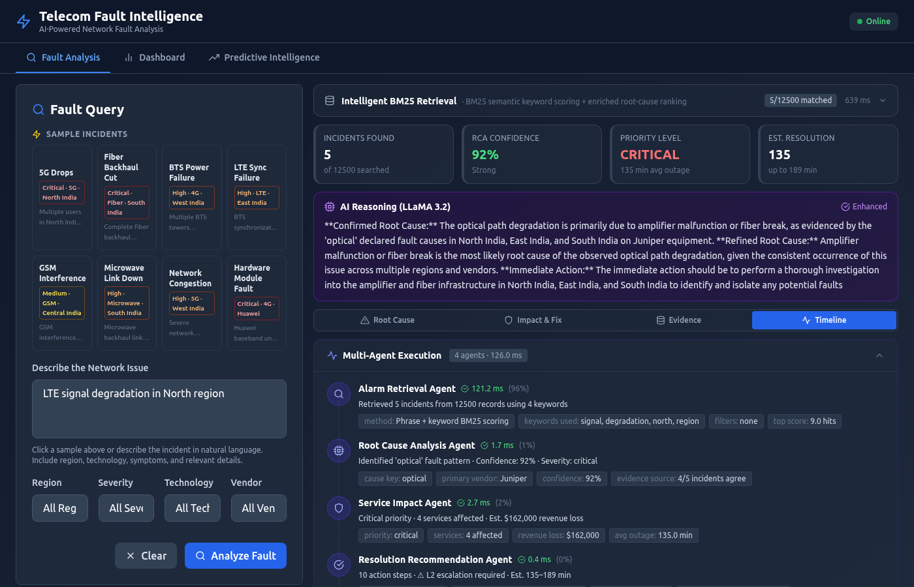
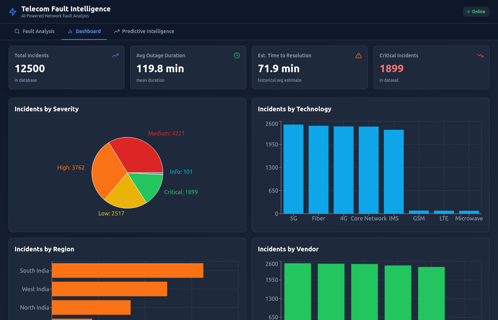
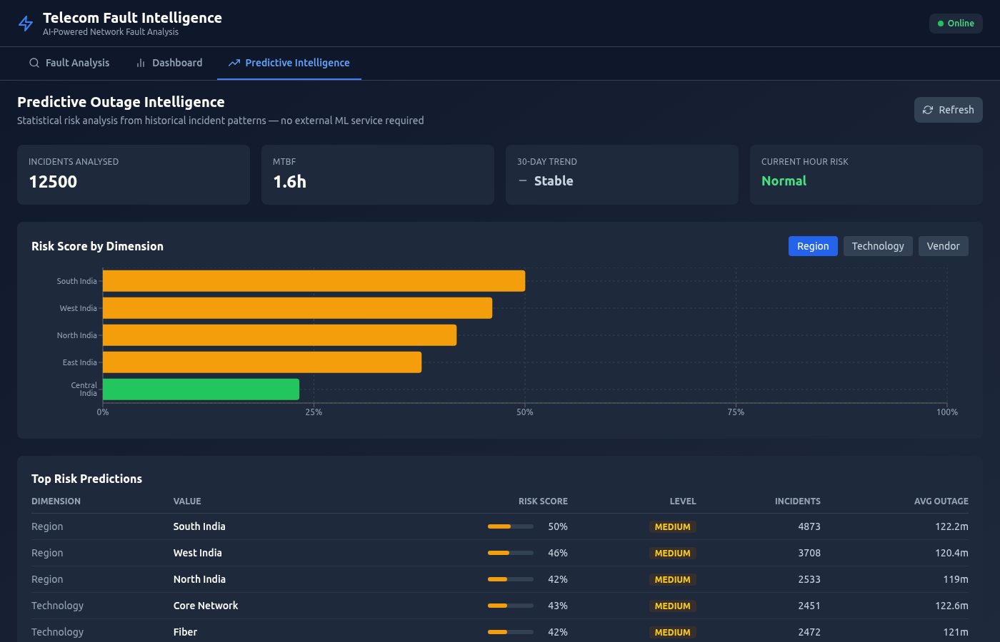

# AI-Powered Telecom Network Fault Intelligence Assistant

Advanced multi-agent AI system for telecom network fault analysis, root cause identification, and intelligent troubleshooting recommendations.

## Project Overview

This system combines BM25 keyword retrieval, optional LLM reasoning (Ollama / Groq / OpenAI), and a custom A2A multi-agent architecture to help telecom engineers rapidly diagnose network faults, identify root causes, assess service impact, and generate actionable resolution steps.

The system operates in three modes and requires no external services beyond an optional LLM:

| Mode | Requires | Speed | Quality |
|------|----------|-------|---------|
| **Ollama + BM25** *(default)* | Ollama running locally | /query: < 200 ms; /enhance: 15–35 s | BM25 retrieval + Llama 3.2 reasoning via Enhance button |
| **BM25 Fallback** | Nothing | < 200 ms | BM25 keyword scoring from local CSV — fully offline |
| **AI (RAG + Agents)** | `OPENAI_API_KEY=sk-...` | 3–6 s | Full vector RAG + 5-agent A2A workflow + LLM reasoning |

**Key Technologies:**
- **Ollama (llama3.2)** — Local LLM reasoning, OpenAI-compatible API; also supports Groq or OpenAI
- **FallbackAnalyzer** — BM25Okapi keyword search over 12,500 telecom incidents (always active)
- **OllamaRCAEnhancer** — Adds LLM root cause reasoning on top of BM25 results
- **Custom A2A Bus** — Per-request Agent-to-Agent message protocol (AI mode)
- **PredictiveOutageEngine** — Statistical outage-risk scoring, no external ML service
- **rank-bm25** — BM25Okapi keyword search engine
- **NetworkX** — Alarm correlation graph analysis
- **tiktoken** — Token-budget context building
- **FastAPI** — Production-ready REST API with input guardrails
- **React 18 + Vite + Tailwind** — Dark-theme SPA
- **ChromaDB** — Local persistent vector store (AI mode only)
- **DeepEval** — RAG quality evaluation (optional)

## Screenshots

| View | Screenshot |
|------|-----------|
| Fault Analysis — home |  |
| Fault Analysis — BM25 results |  |
| After "Enhance with AI" |  |
| Impact & Fix tab |  |
| Evidence tab |  |
| Timeline tab |  |
| Dashboard |  |
| Predictive Intelligence |  |

## Project Structure

```
telecom-fault-intelligence/
├── backend/
│   ├── agents/                        # Multi-agent workflow (AI mode)
│   │   ├── a2a_protocol.py            # A2A bus: MessageType, AgentMessage, A2ABus
│   │   ├── alarm_retrieval_agent.py   # Step 1 — hybrid RAG retrieval
│   │   ├── root_cause_agent.py        # Step 2 — RCA with A2A expansion
│   │   ├── service_impact_agent.py    # Step 4 — revenue & customer impact
│   │   ├── resolution_agent.py        # Step 5 — ranked remediation actions
│   │   └── orchestrator.py            # Workflow coordinator + A2A bus wiring
│   ├── services/
│   │   ├── fallback_analyzer.py       # BM25 analysis — always active, no API key needed
│   │   ├── ollama_enhancer.py         # LLM reasoning on BM25 results (Ollama/Groq/OpenAI)
│   │   ├── predictive_engine.py       # Statistical outage-risk scoring
│   │   ├── rag_pipeline.py            # ChromaDB ingest + hybrid retrieval (AI mode)
│   │   ├── hybrid_search.py           # BM25 + vector + RRF fusion (AI mode)
│   │   ├── reranker.py                # OpenAI embedding cosine-similarity reranker (AI mode)
│   │   ├── alarm_correlation.py       # NetworkX correlation graph
│   │   ├── root_cause_engine.py       # Pattern matching + LLM RCA (AI mode)
│   │   ├── service_impact_engine.py   # Impact quantification + LLM (AI mode)
│   │   └── resolution_engine.py       # Resolution generation + LLM (AI mode)
│   ├── api/
│   │   └── routes.py                  # FastAPI endpoints (/api/v1/*)
│   ├── evaluation/
│   │   └── deepeval_metrics.py        # DeepEval quality evaluation
│   ├── models/
│   │   └── schemas.py                 # Pydantic v2 models
│   ├── utils/
│   │   ├── guardrails.py              # Query validation + prompt-injection detection
│   │   └── token_optimizer.py         # tiktoken context budget management
│   ├── config.py                      # pydantic-settings configuration
│   ├── database.py                    # ChromaDB collection manager
│   ├── ingestion.py                   # CSV → chunks → embeddings pipeline
│   └── main.py                        # FastAPI app factory + lifespan startup
├── frontend/
│   ├── src/
│   │   ├── components/
│   │   │   ├── QueryPanel.jsx         # Query input + filter controls
│   │   │   ├── ResultsPanel.jsx       # Results: Root Cause / Impact & Fix / Evidence / Timeline
│   │   │   ├── Dashboard.jsx          # Analytics dashboard
│   │   │   ├── PredictivePanel.jsx    # Outage risk predictions
│   │   │   └── IncidentDetails.jsx    # Incident detail modal
│   │   ├── App.jsx                    # Tab layout: Fault Analysis / Dashboard / Predictive
│   │   ├── main.jsx
│   │   └── index.css
│   ├── package.json
│   ├── vite.config.js
│   ├── tailwind.config.js
│   └── index.html
├── Data/
│   ├── telecom_dataset_merged.csv     # 12,500 incidents (merged + normalised)
│   ├── telecom_dataset.csv            # Original 500-record base dataset
│   ├── 5G_Network_Performance_Dataset_12000.csv
│   └── chroma_db/                     # Local ChromaDB store (AI mode)
├── screenshots/                       # UI output screenshots
├── logs/
│   └── telecom_fault.log
├── generate_dataset.py
├── enrich_dataset.py
├── test_api.py
├── requirements.txt
├── .env.example
└── README.md
```

## Quick Start

### Prerequisites

- Python 3.10+
- Node.js 18+
- [Ollama](https://ollama.com/) *(optional — for LLM enhancement)*
- OpenAI API key *(optional — for full AI/RAG mode)*

### 1. Backend Setup

```bash
# Install dependencies
pip install -r requirements.txt

# Configure environment
cp .env.example .env
# Edit .env — see Configuration section below

# Start backend
uvicorn backend.main:app --host 0.0.0.0 --port 8000 --reload
```

Backend runs at `http://localhost:8000`
- Swagger UI: `http://localhost:8000/docs`
- Health check: `http://localhost:8000/api/v1/health`

### 2. Frontend Setup

```bash
cd frontend
npm install
npm run dev
```

Frontend runs at `http://localhost:5173`

### 3. Ollama Setup (for LLM enhancement)

```bash
# Install Ollama from https://ollama.com/
ollama pull llama3.2:1b   # lightweight, runs on CPU

# In .env:
OPENAI_API_KEY=ollama
OPENAI_BASE_URL=http://localhost:11434/v1
OPENAI_MODEL=llama3.2:1b
```

## API Endpoints

All endpoints are under the `/api/v1` prefix.

### Fault Analysis

**POST /api/v1/query** — BM25 retrieval + optional inline LLM (0.5s timeout for Ollama CPU)
```json
{
  "query": "Users in North India experiencing 5G connectivity drops",
  "region_filter": "North India",
  "severity_filter": "critical",
  "technology_filter": "5G",
  "vendor_filter": "Ericsson"
}
```

**POST /api/v1/enhance** — Deferred Llama LLM reasoning with 35s timeout. Call after `/query` to overlay AI insights on the existing BM25 result.
```json
{
  "query": "Users in North India experiencing 5G connectivity drops"
}
```

**GET /api/v1/root-cause?query=...** — Root cause analysis only

**GET /api/v1/impact?query=...** — Service impact only

**GET /api/v1/correlate?query=...** — Alarm correlation only

**GET /api/v1/evaluate?query=...** — DeepEval quality metrics

**POST /api/v1/ingest** — Re-ingest dataset into ChromaDB (AI mode only)

**POST /api/v1/reinitialize** — Reinitialize all services

### Predictive Intelligence

**GET /api/v1/predict/outage-risk** — Statistical outage-risk scores

**GET /api/v1/predict/high-risk-alerts** — Active high-risk alerts

**GET /api/v1/predict/risk-by-dimension?dimension=region|technology|vendor** — Risk breakdown

### System

**GET /api/v1/dashboard/metrics** — Analytics: incident counts, MTTR, token stats

**GET /api/v1/health** — Service health, active mode, dataset record count

**GET /api/v1/status** — RAG pipeline and ChromaDB collection statistics

## Frontend UI

Navigate to `http://localhost:5173`. The app has three top-level tabs:

### Fault Analysis tab
1. Enter a fault description in natural language
2. Optionally apply filters (Region / Severity / Technology / Vendor)
3. Click **Analyze Fault** — BM25 results appear in < 200ms
4. Results panel shows four sub-tabs:
   - **Root Cause** — primary/secondary causes, confidence score, BM25 evidence
   - **Impact & Fix** — priority level, revenue loss estimate, resolution steps
   - **Evidence** — retrieved historical incidents with similarity scores
   - **Timeline** — multi-agent execution log (A2A messages, per-agent timings)
5. Click **Enhance with AI** to run Llama 3.2 reasoning (15–35s on CPU) and overlay LLM insights on the existing result

### Dashboard tab
- KPI cards: total incidents, average outage duration, MTTR, critical count
- Charts: incidents by severity, technology, region, vendor

### Predictive Intelligence tab
- Risk scores by region / technology / vendor
- MTBF, 30-day trend, top risk predictions table

## A2A Multi-Agent Protocol (AI mode)

Each `execute_workflow()` call creates a fresh `A2ABus` instance. Messages are dispatched synchronously; the full history is returned under `a2a_messages`.

| Message type | Direction | Purpose |
|---|---|---|
| `NOTIFICATION` | Orchestrator → Agent | Start signals (`start_rca`, `start_impact_analysis`, …) |
| `NOTIFICATION` | Agent → broadcast | Stage completion (`rca_complete`, `impact_complete`, …) |
| `ESCALATION` | AlarmRetrievalAgent → broadcast | Critical severity — expands top-k to 10 |
| `REQUEST` | RootCauseAgent → AlarmRetrievalAgent | Confidence < 50% — request expanded incidents |
| `RESPONSE` | AlarmRetrievalAgent → RootCauseAgent | Expanded incidents for re-analysis |
| `NOTIFICATION` | Orchestrator → broadcast | Cascade alert when correlation ≥ 70% |

## Configuration

Copy `.env.example` to `.env` and edit:

```bash
# ── LLM Provider (pick one) ─────────────────────────────────────────
# Option A: Ollama (local, default)
OPENAI_API_KEY=ollama
OPENAI_BASE_URL=http://localhost:11434/v1
OPENAI_MODEL=llama3.2:1b

# Option B: Groq (fast cloud, free tier)
# OPENAI_API_KEY=gsk_...
# OPENAI_BASE_URL=https://api.groq.com/openai/v1
# OPENAI_MODEL=llama-3.1-8b-instant

# Option C: OpenAI (full AI/RAG mode)
# OPENAI_API_KEY=sk-...
# OPENAI_BASE_URL=
# OPENAI_MODEL=gpt-4o-mini

# Option D: No LLM (BM25 fallback only)
# Leave OPENAI_API_KEY blank

# ── Embeddings (AI mode only) ────────────────────────────────────────
OPENAI_EMBEDDING_MODEL=text-embedding-3-small

# ── ChromaDB (AI mode only) ──────────────────────────────────────────
CHROMA_DB_PATH=./Data/chroma_db

# ── Search ───────────────────────────────────────────────────────────
BM25_K1=2.0
BM25_B=0.75
HYBRID_ALPHA=0.5
TOP_K_RETRIEVAL=5
RERANK_TOP_K=3

# ── Data ─────────────────────────────────────────────────────────────
DATASET_PATH=./Data/telecom_dataset_merged.csv
CHUNK_SIZE=500
CHUNK_OVERLAP=100

# ── API ──────────────────────────────────────────────────────────────
API_PORT=8000
API_WORKERS=4
CORS_ORIGINS=http://localhost:5173,http://localhost:3000

# ── Evaluation ───────────────────────────────────────────────────────
EVALUATION_ENABLED=true
DEEPEVAL_MODEL=gpt-3.5-turbo
DEEPEVAL_THRESHOLD=0.7

# ── Logging ──────────────────────────────────────────────────────────
LOG_LEVEL=INFO
LOG_FILE=./logs/telecom_fault.log
```

## Data

### Dataset
- **Records**: 12,500 realistic telecom incidents (merged from base + 5G performance datasets)
- **Fields**: `alarm_id`, `incident_description`, `network_region`, `technology_type`, `severity`, `outage_duration`, `device_vendor`, `resolution_notes`, `timestamp`, `service_impact`

### Ingestion Pipeline (AI mode only)
1. Load CSV — validation and cleaning
2. Chunk documents — 500 chars, 100 char overlap
3. Generate embeddings — OpenAI `text-embedding-3-small` (1536-dim)
4. Store in ChromaDB with cosine similarity + metadata filtering
5. Build BM25Okapi index in-memory

## Evaluation (DeepEval)

- **Answer Relevancy** — Is the response relevant to the query?
- **Faithfulness** — Are claims grounded in retrieved context?
- **Contextual Precision / Recall** — Retrieved chunk quality
- **Telecom Troubleshooting Score** — Custom heuristic metric (no API key needed)

LLM-dependent metrics fall back to the heuristic when no valid OpenAI key is configured.

## Performance Benchmarks

| Operation | BM25 fallback | Ollama+BM25 | AI mode (OpenAI) |
|---|---|---|---|
| `/query` end-to-end | ~50–200 ms | ~50–200 ms | ~3–6 s |
| `/enhance` (Llama CPU) | — | 15–35 s | — |
| `/enhance` (Groq) | — | ~1–3 s | — |
| Incident retrieval | 10–50 ms | 10–50 ms | 200–500 ms |
| A2A messages/request | — | — | 15–25 msgs |

## Testing

```bash
# Smoke-test all endpoints
python test_api.py

# Run pytest suite
pytest backend/ -v

# Health check
curl http://localhost:8000/api/v1/health

# Test query
curl -X POST http://localhost:8000/api/v1/query \
  -H "Content-Type: application/json" \
  -d '{"query": "Multiple BTS towers reporting sync failures in South India", "region_filter": "South India"}'
```

## Security Considerations

- API keys stored in `.env` (never committed)
- Prompt injection and jailbreak detection on every query
- CORS configured for trusted origins only
- Input length limits enforced at API layer (3–2,000 chars)
- Queries sanitized before LLM calls

## Sample Queries

- "Voice call failures in Mumbai during peak hours"
- "5G handover failures between adjacent cells"
- "Fiber latency spikes between backbone nodes"
- "BTS power supply failure in tier-2 cities"
- "GSM interference from adjacent channels in rural areas"
- "LTE signal degradation in North region"

## References

- [Ollama](https://ollama.com/)
- [ChromaDB Documentation](https://docs.trychroma.com/)
- [FastAPI](https://fastapi.tiangolo.com/)
- [rank-bm25](https://github.com/dorianbrown/rank_bm25)
- [DeepEval](https://docs.confident-ai.com/)
- [React 18](https://react.dev/)
- [Tailwind CSS](https://tailwindcss.com/)

## License

MIT License — See LICENSE file

---

**Version**: 2.0.0
**Status**: Production Ready
**Last updated**: 2026-06-09
